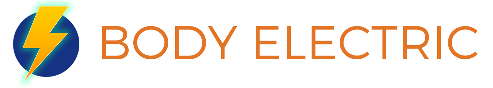

This is the course syllabus for Body Electric (Spring 2016), a 2pt course at ITP, Tisch School of the Arts, NYU.
 
**Instructor:**  
Conor Russomanno  
cr121@nyu.edu  
[@russomanno15](https://twitter.com/russomanno15)
 
 
###Course Description
  
The human body is comprised of many complex systems, all of which are governed by the analog, electrical messages of the nervous systems. We sense. We perceive. We think. And we act. Or maybe we don’t. At every point in the chain electrons are flowing. Where this is true, electrical potentials can be measured with increasingly accessible tools. This class will be a hands-on investigation of the electricity produced by your heart (ECG) muscles (EEG) and brain (EEG). We will use novel devices to tap in, measure, analyze, and make inferences about how our bodies are affected by our environments, and in turn, we will learn to harness the electricity of our bodies to control our environments.

[I Sing the Body Electric](http://www.poetryfoundation.org/poem/174740)  
- by **Walt Witman**

###Technical Requirements

* Proficiency w/ Physical Computing basics (basic electronics and microcontrollers)
* Proficiency w/ Processing or other creative coding frameworks (openFrameworks, Arduino, Max, Unity, etc.)

###Learning Objectives

* Proficiency w/ electrical human-computer interfacing (EEG, EMG, EKG)
* Thorough understanding of the [OpenBCI](http://www.openbci.com/) Biosensing Platform, and [Processing](https://processing.org/)-based [OpenBCI GUI](https://github.com/OpenBCI/OpenBCI_Processing)
* Comfort with the process of creating a code-based project and thoroughly documenting it online, for others to benefit from.

###Course Topics
 
* Biosensing  
* Brain-Computer Interfaces (BCIs)  
* Brain Waves (EEG)  
* Muscle Activity (EMG)  
* Heart Activity (EKG)  
* Neurostimulation (tDCS, tACS, tMS, TENS)  
* 3D-printing
* Open Source Hardware & Software
* Github
 
###Assignments
 
* Weekly Reading & Viewing
* ** Final Project (effectively 70% of your grade) **
	* **Description:** Build an application/implementation/artwork (physical or non-physical) that harnesses brain, muscle, and/or heart activity in some fashion. It could be a game, a biofeedback application, a neuro-powered robot or machine, etc. This project is very open-ended, so be sure to hone in on something early on; biosensing is harder than you think, so be sure not to bite off more than you can chew (I'll do my best to help contain enthusiasm). You'll be working in groups, and I'll do my best to make sure the groups are balanced with respect to technical/design/documentation proficiencies. All three are equally important for this project.
	* **Groups:** 4 people per group. You will have the same group for the duration of the course. If you run into group dynamic problems, please come to me.
	* **Requirements:** 
		* You must document your work thoroughly, and publish it online. If you have an issue with this (as a result of IP concerns), discuss with me.
		* Your project's code must end up on Github (or a similar code-sharing platform) w/ a thorough readme.
	* **Evaluation Metrics:**
		* [25%] Technical Achievement
		* [25%] Creativity/Novelty
		* [25%] Design & Aesthetics
		* [25%] Documentation

###Weekly Schedule

1. **Week 1 (1/25/16)** -- Introductions, Syllabus Review, Project Review, Intro to Biosensing, Intro to OpenBCI.
2. **Week 2 (2/1/16)** -- Group Meeting #1, Ultracortex Assembly, Fire Up The OpenBCI GUI, Initial Project Conversations w/ Group
3. **Week 3 (2/8/16)** -- Harnessing the [OpenBCI GUI](https://github.com/OpenBCI/OpenBCI_Processing), Alpha Throttle, EMG Symphony, Neuro-Powered Robotics, [SSVEP](https://en.wikipedia.org/wiki/Steady_state_visually_evoked_potential) neuromodulation.
4. **Week 4 (2/15/16)** -- **Field Trip** -- OpenBCI HQ ([NeuroTechNYC](http://www.meetup.com/NeuroTechNYC/) Meetup) -- **Mid-Course Final Project Update, Prototype, & Documentation Due**
5. **Week 5 (2/22/16)** -- Neurostimulation Experimentation (tDCS & Thync), Neuroethics Mini-Lecture, In-Class Work Day
6. **Week 6 (2/29/16)** -- Final Project Presentations (Show & Tell Style)
 
###Grading

* [30%] - Attendance & Class Participation
* [20%] - Mid-Course Final Project Update, Prototype, & Documentation
* [50%] - Final Project Presentation & Documentation

###Attendance & Participation

Pretty simple. Show up and be engaged. If you miss more than one class, it's a Fail. If you make it to all 6 classes and show up on time, your **Attendace & Participation** grade will be great! 

Please try your hardest to not be late. It disturbs the flow of class, and is therefore disrespectful to your peers.

If you have to be absent, please let me know before class.

###Resources

**OpenBCI Related**

* [OpenBCI Website](http://www.openbci.com/)
* [OpenBCI Learning Interface](http://docs.openbci.com/tutorials/01-GettingStarted) ("The OpenBCI Dictionary")
* [OpenBCI Github](https://github.com/OpenBCI) (code repos, starting points, and software SDKs)
	* [Processing](https://github.com/OpenBCI/OpenBCI_Processing)
	* [Node.js](https://github.com/OpenBCI/openbci-js-sdk)
	* [Python](https://github.com/OpenBCI/OpenBCI_Python)
	* [Ultracortex Mark III 3D-printable EEG Headset](https://github.com/OpenBCI/Ultracortex)
* [OpenBCI Community Page](http://openbci.com/community/) (for project inspiration & sharing)
* [OpenBCI Forum](http://openbci.com/index.php/forum/) (very active, you'll usually get a response that day)
* [Top 10 OpenBCI Community Projects!](https://www.kickstarter.com/projects/openbci/openbci-biosensing-for-everybody/posts/1446218)

**Related Blogs, Projects, Software, Tools**

* OpenVIBE ([OpenBCI Setup](http://docs.openbci.com/research%20tools/OpenViBE))
* Neuromore ([OpenBCI Setup](http://docs.openbci.com/research%20tools/Neuromore))
* [EEG Hacker](http://eeghacker.blogspot.com/) -- Amazingly Thorough EEG+OpenBCI Blog
* [NeuroTechMTL Blog](http://bcimontreal.org/bci-blog/)
* [Cloudbrain](http://getcloudbrain.com/) -- An Open-Source Platform For Wearable Data Analytics
* [How To Hack Toy EEGs](http://www.frontiernerds.com/brain-hack), by the Frontier Nerds of ITP (a personal favorite)
* BrainBay
* BCI 2000
* MatLab
* [The OpenEEG Project](http://openeeg.sourceforge.net/doc/)

**Related Products**

* [Backyard Brains](https://backyardbrains.com/) -- An Awesome Open-Source Biosensing Company
* [NeuroSky](http://neurosky.com/)
* [Emotiv](https://emotiv.com/)
* [InteraXon Muse](http://www.choosemuse.com/)
* [Foc.us](http://www.foc.us/)
* [Thync](http://www.thync.com/)
* [Neurolaunch](http://neurolaunch.com/) -- "The World's First Neuroscience Startup Accelerator"

**Related Hackathons, Meetups, Groups, Conferences, etc.**

* [NeuroTechNYC Meetup Group](http://www.meetup.com/NeuroTechNYC/)
* [NeuroTechX](http://neurotechx.com/) International Neurotech Network ([Slack signup](https://neurotechx.herokuapp.com/))
* [HackTheBrain Hackathon Series](http://hackthebrain.nl/) & [UK](http://www.hackthebrain.uk/)
* [Experimental Technology & Neurogaming Conference & Expo](http://www.neurogamingconf.com/)
* [Bodyhacking Conference](https://bodyhackingcon.com/)
* [Brainihack Hackathon Series](http://brainihack.org/)
* [Bots & Brains Meetup Group](http://www.meetup.com/Bots-and-Brains-NYC/)
* [Futurism NYC Meetup Group](http://www.meetup.com/futurismnyc/)
* [NYC Machine Learning Meetup Group](http://www.meetup.com/NYC-Machine-Learning/)
* [CodeNeuro](http://codeneuro.org/)

 
 
